# Event Detection from Market Order Snapshots

## Table of Contents
1. [Event Detection Principles](#event-detection-principles)
2. [Pandas Implementation (Baseline)](#pandas-implementation-baseline)
3. [Polars Implementation (Optimized)](#polars-implementation-optimized)
4. [Dask Implementation (Parallel)](#dask-implementation-parallel)
5. [Performance Comparison](#performance-comparison)
6. [Key Takeaways](#key-takeaways)

---

## Event Detection Principles

### The Core Problem

We have market order **snapshots** taken every 5 minutes:

```
Snapshot T0              Snapshot T1
─────────────            ─────────────
Order 123: 100 @ $5.50   Order 123: 80 @ $5.50   → TRADE (20 units traded)
Order 456: 50 @ $5.45    [missing]                → CANCELLED or EXPIRED
Order 789: 200 @ $5.40   Order 789: 200 @ $5.60   → PRICE_CHANGED
                         Order 999: 150 @ $5.35   → ORDER_OPENED (new)
```

**Goal**: Extract **events** (changes) from snapshot pairs to create a compact event log.

### Two Processing Modes

All three implementations support two distinct modes:

#### **Mode 1: Initialization**
```python
initialize_from_snapshot(snapshot_path, timestamp)
```
- **Purpose**: Bootstrap the system with the first snapshot
- **Process**: Read the entire first snapshot and create ORDER_OPENED events for ALL existing orders
- **Output**: Every order gets a full-state ORDER_OPENED event (includes location_id, volume_total, etc.)
- **Why needed**: Establishes the baseline state before delta detection can begin

**Example**:
```
First snapshot has 10,000 orders
→ Generates 10,000 ORDER_OPENED events
```

#### **Mode 2: Delta Detection**
```python
detect_events(prev_snapshot_path, current_snapshot_path, timestamp)
```
- **Purpose**: Extract only the changes between two consecutive snapshots
- **Process**: Compare snapshots T0 and T1 to find differences
- **Output**: Only change events (TRADE, PRICE_CHANGED, ORDER_CLOSED, etc.)
- **Why efficient**: Sparse schema - only deltas stored, not full state

**Example**:
```
Snapshot with 10,000 orders, only 100 changed
→ Generates ~100 events (not 10,000)
```

### Event Types

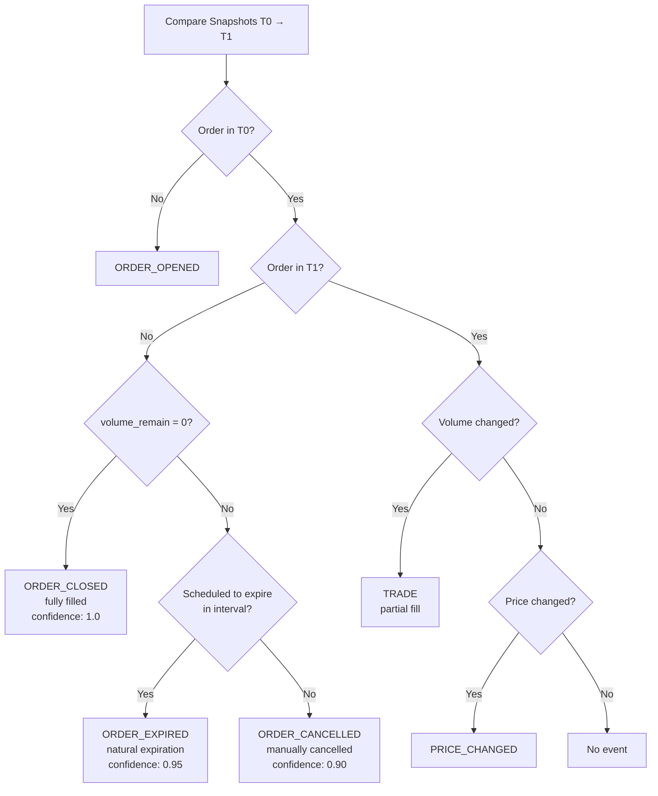

### Event Schema: Sparse Storage

Events use a **sparse schema** where different event types populate different fields:

| Event Type | Core Fields | Delta Fields | Full-State Fields |
|------------|-------------|--------------|-------------------|
| ORDER_OPENED | ✓ | ✓ | ✓ (location_id, volume_total, etc.) |
| TRADE | ✓ | ✓ (volume traded) | ✗ (NULL) |
| ORDER_CLOSED | ✓ | ✓ (volume=0) | ✗ (NULL) |
| ORDER_CANCELLED | ✓ | ✓ | ✗ (NULL) |
| ORDER_EXPIRED | ✓ | ✓ | ✗ (NULL) |
| PRICE_CHANGED | ✓ | ✓ (new price) | ✗ (NULL) |

**Why sparse?** Parquet's columnar format with RLE compression makes NULL values nearly free. ~85% of events have NULL for full-state fields, but this costs almost nothing in storage.

### Detection Algorithm: Core Steps

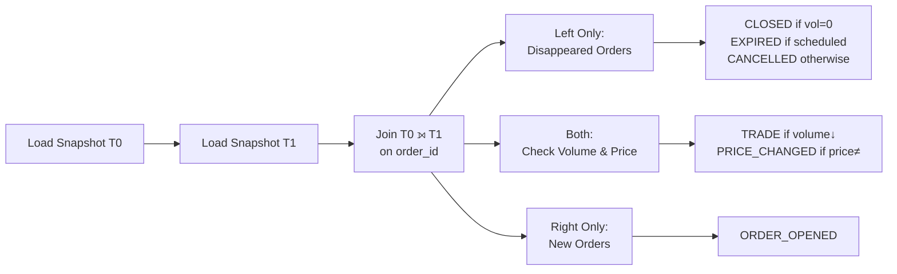

**Key Insight**: A join operation gives us three sets:
- **Left-only**: Orders that disappeared (T0 but not T1)
- **Both**: Orders present in both snapshots (check for changes)
- **Right-only**: New orders (T1 but not T0)

---

## Pandas Implementation (Baseline)

### Philosophy: Vectorize What You Can

**Pandas excels at**: Mature ecosystem, familiar API, efficient single-threaded operations, great for medium-sized data.

**Key principle**: Use vectorized operations where possible, accept that some iteration is necessary, optimize iteration with `itertuples()`.

### Implementation Overview

**Two processing modes**:

1. **Initialization** (`initialize_from_snapshot`):
   - Read first snapshot with `pd.read_parquet()`
   - Iterate through ALL orders using `itertuples(index=False)`
   - Create ORDER_OPENED event for each order with full state
   - **Single-threaded I/O** (pyarrow backend)

2. **Delta Detection** (`detect_events`):
   - Read both snapshots
   - Perform outer merge to get all three sets
   - Filter to find changes
   - Create events only for changes

### Join Strategy: Single Outer Merge

**Pandas uses ONE outer merge with `indicator=True`:**

**Understanding column suffixes**:

```text
suffixes=('', '_curr') means:
  - prev_snapshot (T0) columns get NO suffix → volume_remain, price, type_id
  - current_snapshot (T1) columns get '_curr' suffix → volume_remain_curr, price_curr, type_id_curr
```

```python
# Single outer merge captures all three cases
merged = prev_snapshot.merge(
    current_snapshot,
    on='order_id',
    how='outer',      # Keep all orders from both snapshots
    indicator=True,   # Adds '_merge' column
    suffixes=('', '_curr')  # T0 = no suffix, T1 = '_curr'
)

# Three sets from one merge
disappeared = merged[merged['_merge'] == 'left_only']   # Only in T0
both = merged[merged['_merge'] == 'both']               # In both T0 and T1
new_orders = merged[merged['_merge'] == 'right_only']   # Only in T1
```

**Venn diagram explanation**:

```text
         T0 (prev)              T1 (current)
    ┌─────────────────┐    ┌─────────────────┐
    │                 │    │                 │
    │   order 100     │    │                 │
    │  (disappeared)  │    │                 │
    │                 │    │                 │
    │            ┌────┼────┼────┐            │
    │            │    │    │    │            │
    │            │ 200,300 │    │  order 400 │
    │            │ (both)  │    │   (new)    │
    │            │    │    │    │            │
    │            └────┼────┼────┘            │
    │                 │    │                 │
    └─────────────────┘    └─────────────────┘
         left_only            right_only
                    both
```

**Outer merge gets ALL three regions**:

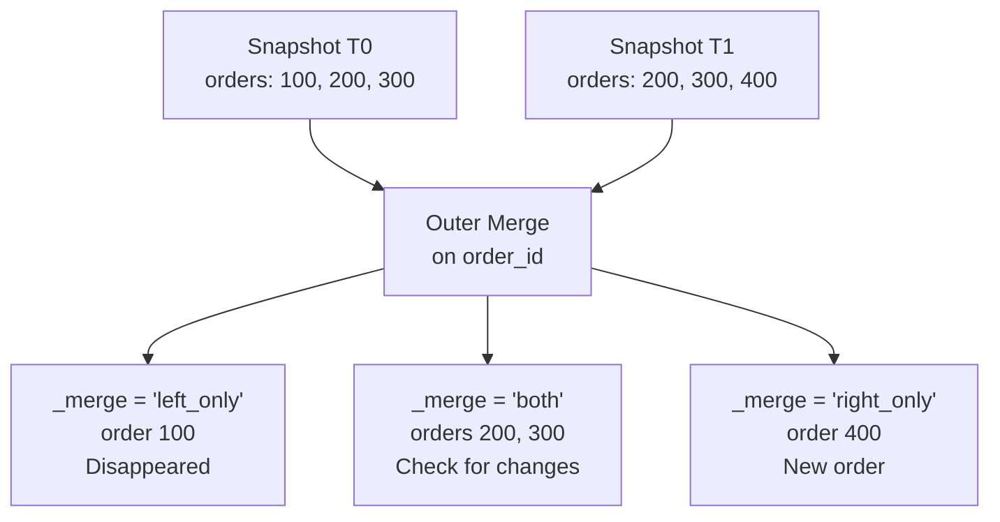

**Why outer merge?**
- ✅ Simple: Gets all three sets in a **single** operation
- ✅ Clear: The `indicator=True` column explicitly shows the source
- ❌ Overhead: Processes entire dataset even for "not in" queries
- ❌ Single-threaded: No parallelism

### Critical Optimizations

#### 1. itertuples() Instead of iterrows()

```python
# ❌ NEVER use this (5-10× slower):
for index, row in df.iterrows():
    event = TradingEvent(
        order_id=row['order_id'],
        price=row['price']
    )

# ✅ ALWAYS use this:
for row in df.itertuples(index=False):
    event = TradingEvent(
        order_id=row.order_id,  # Attribute access, not dict lookup
        price=row.price
    )
```

**Why faster?**
- `iterrows()` returns Series objects (heavy Python overhead, type checking per access)
- `itertuples()` returns namedtuples (lightweight C structs)
- **5-10× speedup** for iteration-heavy code

#### 2. Vectorized Volume Calculation

**Context**: After the outer merge, we filter to find orders with volume reductions (trades):

```python
# The merge gives us columns from both snapshots
# suffixes=('', '_curr') means:
#   - T0 (prev_snapshot) columns have NO suffix: volume_remain, price, etc.
#   - T1 (current_snapshot) columns have '_curr' suffix: volume_remain_curr, price_curr, etc.

merged = prev_snapshot.merge(current_snapshot, on='order_id', how='outer',
                            indicator=True, suffixes=('', '_curr'))

# Filter: orders in both snapshots where volume decreased
both = merged[merged['_merge'] == 'both']
partial_fills = both[both['volume_remain'] > both['volume_remain_curr']]
                    # ↑ T0 volume        ↑ T1 volume

# Now partial_fills has these columns:
# Without suffix (from T0 - previous snapshot):
#   - volume_remain, price, type_id, order_id, is_buy_order, system_id
# With '_curr' suffix (from T1 - current snapshot):
#   - volume_remain_curr, price_curr, type_id_curr, etc.
```

**Optimization**: Calculate all volume_traded values at once (vectorized):

```python
# ✅ Vectorized: single NumPy operation for ALL rows
volume_traded = (partial_fills['volume_remain'] - partial_fills['volume_remain_curr']).values

# Then iterate with pre-computed values
for i, row in enumerate(partial_fills.itertuples(index=False)):
    event = TradingEvent(
        event_type=EventType.TRADE,
        timestamp=timestamp,
        type_id=int(row.type_id),           # From merged dataframe
        order_id=int(row.order_id),         # From merged dataframe
        volume=int(volume_traded[i]),       # Pre-computed above
        price=float(row.price),             # From merged dataframe
        is_buy_order=bool(row.is_buy_order),# From merged dataframe
        system_id=int(row.system_id),      # From merged dataframe
        confidence=1.0
    )
```

**Why vectorize?**

- ❌ Without vectorization: `volume = row.volume_remain - row.volume_remain_curr` (N Python operations)
- ✅ With vectorization: Single NumPy array operation, then just array lookups in loop
- **Result**: Faster because NumPy/C does the math, not Python

### Architecture

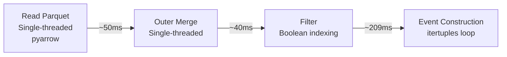

### Performance Characteristics

**Bottleneck**: Python object construction (largest component ~65-70%) + single-threaded I/O and merge.

**Strengths**:
- Simple, well-understood API
- Excellent ecosystem and documentation
- Good for exploratory analysis

**Weaknesses**:
- Single-threaded throughout (no parallelism)
- Higher memory usage (row-oriented storage internally)
- Slower for large datasets

---

## Polars Implementation (Optimized)

### Philosophy: Pure Vectorization + Multi-threading

**Polars excels at**: Multi-threaded columnar operations, lazy evaluation, query optimization in Rust.

**Key principle**: Eliminate Python loops entirely where possible. Let Polars' Rust-based engine handle all data processing with multi-threading.

### Implementation Overview

**Two processing modes** (same as Pandas):

1. **Initialization** (`initialize_from_snapshot`):
   - Read first snapshot with `pl.read_parquet()`
   - **Multi-threaded I/O** (Rust-based parallel row group reads)
   - Iterate through ALL orders using `iter_rows(named=True)`
   - Create ORDER_OPENED event for each order with full state

2. **Delta Detection** (`detect_events`):
   - Read both snapshots (multi-threaded)
   - Perform **TWO** joins: left join + anti-join
   - Vectorized filtering with `.filter()` and `.with_columns()`
   - Create events only for changes

### Join Strategy: Left Join + Anti-Join

**Polars uses TWO joins** (different from Pandas):

```python
# Join 1: Left join for disappeared/changed orders
joined = prev_snapshot.join(
    current_snapshot,
    on='order_id',
    how='left',  # Keep all prev orders
    suffix='_curr'
)

# Filter into categories
disappeared = joined.filter(pl.col('type_id_curr').is_null())
still_present = joined.filter(pl.col('type_id_curr').is_not_null())
partial_fills = still_present.filter(pl.col('volume_remain') > pl.col('volume_remain_curr'))
price_changes = still_present.filter(pl.col('price') != pl.col('price_curr'))

# Join 2: Anti-join for new orders
new_orders = current_snapshot.join(
    prev_snapshot.select(['order_id']),
    on='order_id',
    how='anti'  # Only orders NOT in prev
)
```

**Venn diagram explanation**:

```text
JOIN 1: Left Join (keeps all T0, adds T1 where match)
         T0 (prev)              T1 (current)
    ┌─────────────────┐    ┌─────────────────┐
    │                 │    │                 │
    │   order 100  ✓  │    │                 │
    │  (disappeared)  │    │                 │
    │  type_id_curr   │    │                 │
    │   = NULL        │    │                 │
    │            ┌────┼────┼────┐            │
    │            │    │    │    │  order 400 │
    │            │ 200,300 │ ✓  │   (ignored │
    │            │ (both)  │    │  in left   │
    │            │ matched │    │   join)    │
    │            └────┼────┼────┘            │
    │                 │    │                 │
    └─────────────────┘    └─────────────────┘
    Left join returns: orders 100, 200, 300

JOIN 2: Anti-Join (only T1 NOT in T0)
         T0 (prev)              T1 (current)
    ┌─────────────────┐    ┌─────────────────┐
    │                 │    │                 │
    │   order 100     │    │                 │
    │   (ignored)     │    │                 │
    │                 │    │                 │
    │            ┌────┼────┼────┐            │
    │            │    │    │    │            │
    │            │ 200,300 │    │  order 400 │
    │            │(ignored)│    │   (new) ✓  │
    │            │    │    │    │            │
    │            └────┼────┼────┘            │
    │                 │    │                 │
    └─────────────────┘    └─────────────────┘
    Anti-join returns: order 400
```

**Polars uses TWO joins to get the three regions**:

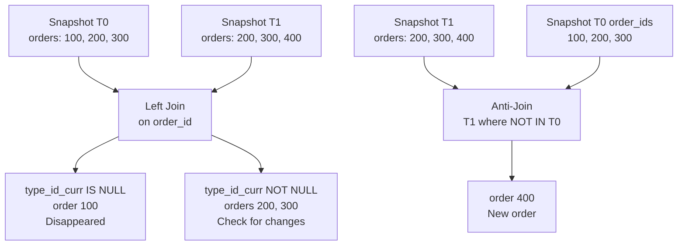

**Why two joins?**
- ✅ **Left join** finds disappeared/changed orders efficiently
- ✅ **Anti-join** is optimized specifically for "not in" queries in Rust
- ✅ **Multi-threaded**: Both joins run on multiple threads
- ✅ **Query optimization**: Polars can optimize the execution plan
- ❌ Slightly more complex than Pandas single merge

**Comparison of join strategies**:

| Aspect | Pandas (Outer Merge) | Polars (Left + Anti) |
|--------|----------------------|----------------------|
| **Operations** | 1 merge | 2 joins |
| **Complexity** | Simpler | Slightly more complex |
| **Threading** | Single-threaded | Multi-threaded |
| **Memory** | Higher (full outer join) | Lower (targeted joins) |
| **Performance** | Baseline | 4.7× faster |

### Critical Optimizations

#### 1. Vectorized Field Computation with `.with_columns()`

**Context**: After the left join, we filter to find orders with volume reductions (trades):

```python
# The left join gives us columns from both snapshots
# suffix='_curr' means:
#   - T0 (prev_snapshot) columns have NO suffix: volume_remain, price, etc.
#   - T1 (current_snapshot) columns have '_curr' suffix: volume_remain_curr, price_curr, etc.

joined = prev_snapshot.join(current_snapshot, on='order_id',
                           how='left', suffix='_curr')

# Filter: orders in both snapshots where volume decreased
still_present = joined.filter(pl.col('type_id_curr').is_not_null())
partial_fills = still_present.filter(pl.col('volume_remain') > pl.col('volume_remain_curr'))
                                    # ↑ T0 volume           ↑ T1 volume

# Now partial_fills has these columns:
# Without suffix (from T0 - previous snapshot):
#   - volume_remain, price, type_id, order_id, is_buy_order, system_id
# With '_curr' suffix (from T1 - current snapshot):
#   - volume_remain_curr, price_curr, type_id_curr, etc.
```

**Optimization**: Use `.with_columns()` to add computed columns (vectorized in Rust):

```python
# ✅ Vectorized: Rust-based operation for ALL rows, multi-threaded
with_traded = partial_fills.with_columns([
    (pl.col('volume_remain') - pl.col('volume_remain_curr')).alias('volume_traded')
])

# Then iterate with pre-computed values
for row in with_traded.iter_rows(named=True):
    event = TradingEvent(
        event_type=EventType.TRADE,
        timestamp=timestamp,
        type_id=int(row['type_id']),           # From joined dataframe
        order_id=int(row['order_id']),         # From joined dataframe
        volume=int(row['volume_traded']),      # Pre-computed above in Rust
        price=float(row['price']),             # From joined dataframe
        is_buy_order=bool(row['is_buy_order']),# From joined dataframe
        system_id=int(row['system_id']),      # From joined dataframe
        confidence=1.0
    )
```

**Why use `.with_columns()`?**

- ❌ Without: `volume = row['volume_remain'] - row['volume_remain_curr']` (N Python operations)
- ✅ With: Single Rust operation, **multi-threaded**, then just dict lookups in loop
- **Result**: Much faster because Rust does the math in parallel, not Python serially

#### 2. Multi-threaded I/O

```python
# Polars automatically uses multiple threads for Parquet I/O
snapshot = pl.read_parquet(snapshot_path)  # Parallel row group reads
```

**Advantage**: Polars' Rust backend parallelizes I/O operations automatically across CPU cores.

#### 3. Fast Iteration with iter_rows(named=True)

```python
# Polars' iteration method
for row in df.iter_rows(named=True):
    process(row['order_id'], row['price'])
```

**Performance**: Comparable to Pandas' `itertuples()`, both use namedtuple-like structures.

### Architecture

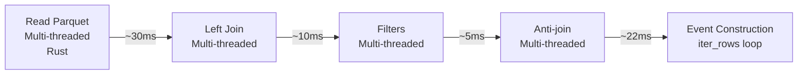

### Performance Characteristics

**Bottleneck**: Event object construction (Python loop with dataclass instantiation). This cannot be vectorized as we need Python objects. However, the bottleneck is much smaller proportionally due to faster upstream processing.

**Strengths**:
- **Multi-threaded** throughout (Rust-based parallelism)
- **Low memory usage** (efficient Arrow-based columnar storage)
- **Fast joins** (optimized anti-join for "not in" queries)
- **Query optimization** (can reorder and optimize operations)

**Weaknesses**:
- Less mature ecosystem than Pandas
- Different API (learning curve)
- Still requires Python iteration for object construction

---

## Dask Implementation (Parallel)

### Philosophy: Parallelize the Workload

**Dask excels at**: Processing multiple files in parallel, scaling across CPU cores and clusters, handling data larger than RAM.

**Key principle**: For single files, Dask adds overhead. Dask wins when processing **batches** of files in parallel or very large datasets.

### Implementation Overview

**Three processing modes** (one more than Pandas/Polars):

1. **Initialization** (`initialize_from_snapshot`):
   - Read first snapshot with `dd.read_parquet().compute()`
   - **Uses Pandas backend** after `.compute()`
   - Same implementation as Pandas from this point

2. **Delta Detection - Single Pair** (`detect_events`):
   - Read both snapshots
   - **Uses Pandas backend** (same as Pandas implementation)
   - **Not recommended**: Adds Dask scheduling overhead without benefit

3. **Batch Processing** (`detect_events_batch`) - **Dask's Unique Feature**:
   - Process MULTIPLE snapshot pairs in PARALLEL
   - Uses `dask.delayed()` for lazy task creation
   - Executes all tasks simultaneously across CPU cores
   - **This is where Dask shines!**

### Dask's Unique Feature 1: Batch Processing

**Problem**: Sequential processing is slow for many files:

```python
# ❌ Sequential (slow): 4 pairs × 300ms = 1200ms
for prev, curr, ts in snapshot_pairs:
    events = detector.detect_events(prev, curr, ts)
```

**Solution**: Parallel batch processing:

```python
# ✅ Parallel (fast): 300ms total with 4 workers
def detect_events_batch(snapshot_pairs: List[tuple]):
    # Create lazy tasks (not executed yet)
    tasks = [
        dask.delayed(self._detect_events_single)(prev, curr, ts)
        for prev, curr, ts in snapshot_pairs
    ]

    # Execute ALL tasks in parallel across CPU cores
    results = dask.compute(*tasks, num_workers=self.n_workers)

    # Flatten results
    all_events = []
    for events in results:
        all_events.extend(events)
    return all_events
```

**Visual representation**:

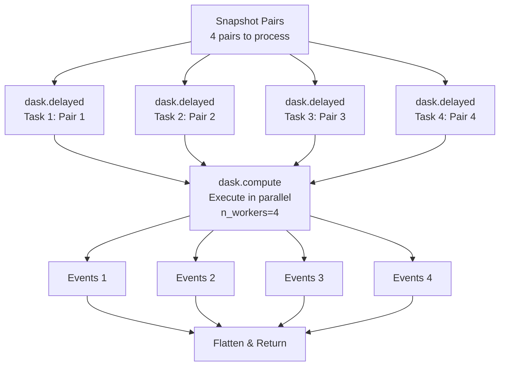

**How it works**:
1. `dask.delayed()` wraps function calls without executing them (lazy evaluation)
2. `dask.compute()` builds a task graph and executes all tasks in parallel
3. Each worker processes a different snapshot pair simultaneously
4. Results are collected and flattened

**Parallel execution timeline**:

```mermaid
gantt
    title Sequential vs Parallel Processing (4 snapshot pairs)
    dateFormat X
    axisFormat %S

    section Sequential
    Pair 1: 0, 100
    Pair 2: 100, 200
    Pair 3: 200, 300
    Pair 4: 300, 400

    section Parallel (4 cores)
    Pair 1: 0, 100
    Pair 2: 0, 100
    Pair 3: 0, 100
    Pair 4: 0, 100
```

**Result**: ~4× speedup with 4 cores (near-linear scaling for independent tasks).

### Dask's Unique Feature 2: Within-File Parallelization

**Problem**: Single very large file (> 1 GB) is too big to process efficiently.

**Solution**: Partition by type_id and process partitions in parallel:

```python
def detect_events_parallel_by_type(prev_snapshot_path, current_snapshot_path, timestamp):
    # Read data
    prev_snapshot = dd.read_parquet(prev_snapshot_path).compute()
    curr_snapshot = dd.read_parquet(current_snapshot_path).compute()

    # Partition by type_id ranges
    type_ids = prev_snapshot['type_id'].unique()
    num_partitions = min(n_workers, len(type_ids) // 1000 + 1)

    # Assign partition IDs
    partition_map = assign_partitions(type_ids, num_partitions)
    prev_snapshot['_partition'] = prev_snapshot['type_id'].map(partition_map)
    curr_snapshot['_partition'] = curr_snapshot['type_id'].map(partition_map)

    # Process each partition in parallel
    @dask.delayed
    def process_partition(partition_id):
        prev_part = prev_snapshot[prev_snapshot['_partition'] == partition_id]
        curr_part = curr_snapshot[curr_snapshot['_partition'] == partition_id]
        return detect_events_for_partition(prev_part, curr_part)

    tasks = [process_partition(i) for i in range(num_partitions)]
    results = dask.compute(*tasks, num_workers=n_workers)

    # Combine all partition results
    return flatten(results)
```

**When useful**:
- Very large snapshot files (> 1 GB)
- Many unique type_ids (thousands)
- Single snapshot pair but too large to process efficiently

**Overhead**: Partitioning + synchronization costs only worth it for large files.

### When Dask Wins vs Loses

**✅ Good use case** (Dask shines):
```python
# Processing 1 hour of data (12 snapshot pairs)
detector = DaskEventDetector(n_workers=4)
results = detector.detect_events_batch(twelve_snapshot_pairs)
# Result: 3-4× faster than sequential processing
```

**❌ Poor use case** (Dask overhead dominates):
```python
# Processing a single snapshot pair
detector = DaskEventDetector(n_workers=4)
results = detector.detect_events(snapshot_t0, snapshot_t1, timestamp)
# Result: Actually SLOWER due to task scheduling overhead (~10-50ms)
```

### Architecture

**For batch processing**:

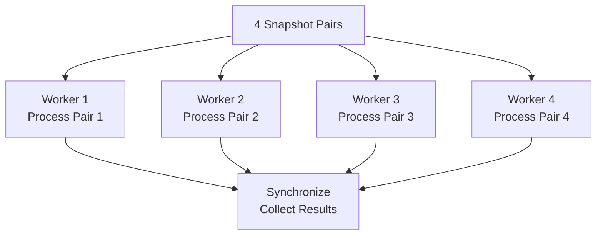

### Performance Characteristics

**Best case**: Near-linear scaling with CPU cores for batch processing (4 cores ≈ 4× speedup).

**Overhead**: Task scheduling (~10-50ms per task), only worthwhile for:
- Multiple files (batch processing)
- Very large files (partition processing)
- Distributed clusters

**Key differences from Pandas and Polars**:

| Aspect | Dask | Pandas | Polars |
|--------|------|--------|--------|
| **Backend** | Uses Pandas after `.compute()` | Native | Native (Rust) |
| **Batch Processing** | ✅ `detect_events_batch()` | ❌ No | ❌ No |
| **Partition Processing** | ✅ `detect_events_parallel_by_type()` | ❌ No | ❌ No |
| **Single File Performance** | Slower (overhead) | Baseline | Fastest (4.7×) |
| **Multi-File Performance** | Fast (parallel) | Slow (sequential) | Slow (sequential) |
| **Scalability** | Excellent (clusters) | Limited (single-threaded) | Good (multi-threaded) |

**Strengths**:
- **True parallelism** across multiple files
- **Configurable workers** (`n_workers` parameter)
- **Scales to clusters** (distributed processing)
- **Handles data > RAM** (lazy evaluation)

**Weaknesses**:
- Task scheduling overhead
- Uses Pandas backend (inherits Pandas single-threaded performance)
- More complex API
- Overhead not justified for small workloads

---

## Performance Comparison

### Benchmark Results (3 Snapshot Pairs, ~70K orders each)

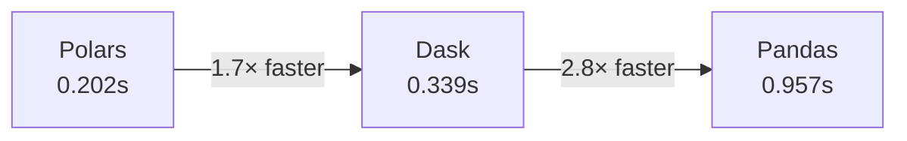

| Backend | Total Time | Speedup vs Pandas | Events Detected |
|---------|-----------|-------------------|-----------------|
| **Polars** | 0.202s | **4.7×** | 2,912 |
| **Dask** | 0.339s | 2.8× | 2,912 |
| **Pandas** | 0.957s | 1.0× (baseline) | 2,912 |

### Why These Results?

**Polars dominates** because:
- Multi-threaded I/O and processing (Rust-based)
- Vectorized operations eliminate Python loops
- Efficient Arrow-based memory layout
- Query optimization reduces unnecessary work
- Optimized anti-join for "not in" queries

**Dask is middle** because:
- ✅ Parallel batch processing helps (using 4 cores)
- ❌ But task scheduling overhead adds cost (~10-50ms per task)
- ❌ Only 3 pairs → limited parallelism benefit (overhead > benefit threshold)
- ✅ Would scale much better with more files (12+ pairs)

**Pandas is slowest** because:
- Single-threaded processing throughout
- Higher memory usage (row-oriented storage internally)
- More Python interpreter overhead
- No parallelism at any level

### Scaling Characteristics

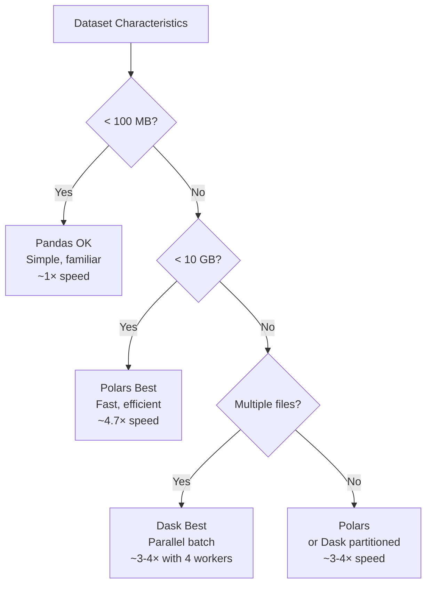

### Real-World Impact (288 Snapshots/Day)

Processing a full day of market data:

| Backend | Time/Day | CPU Efficiency | Memory Usage | Recommended For |
|---------|----------|----------------|--------------|-----------------|
| **Polars** | ~5-10 min | High (multi-core single file) | Low (~35 MB/snapshot) | Single-machine processing |
| **Dask** | ~15-30 min | Medium (scheduling overhead) | Low (lazy, batch) | Batch processing, clusters |
| **Pandas** | ~25-50 min | Low (single-core) | High (~70 MB/snapshot) | Small exploratory work |

---

## Key Takeaways

### 1. Choose the Right Tool for the Job

| Use Case | Best Library | Why |
|----------|-------------|-----|
| **Single snapshot pair, < 1 GB** | Pandas | Simple, familiar, no overhead |
| **Single snapshot pair, any size** | **Polars** | Fastest single-pair processing (4.7×) |
| **Batch processing (many pairs)** | **Dask** | True parallelism across files |
| **Very large single files (> 1 GB)** | Dask (partitioned) | Partition-based parallelism |
| **Data > RAM** | Dask | Lazy evaluation, distributed processing |
| **Exploratory analysis** | Pandas | Familiar API, great ecosystem |
| **Production pipelines** | Polars or Dask | Performance matters at scale |

### 2. Implementation Differences Summary

| Feature | Pandas | Polars | Dask |
|---------|--------|--------|------|
| **Threading** | Single-threaded | Multi-threaded (Rust) | Configurable workers |
| **Join Strategy** | 1 outer merge | 2 joins (left + anti) | Uses Pandas backend |
| **I/O** | Single-threaded | Multi-threaded | Parallel (batch mode) |
| **Iteration** | `itertuples()` | `iter_rows(named=True)` | `itertuples()` (Pandas) |
| **Vectorization** | Partial (volume calc) | Full (`with_columns`) | Partial (Pandas-based) |
| **Batch Processing** | ❌ No | ❌ No | ✅ `detect_events_batch()` |
| **Partition Processing** | ❌ No | ❌ No | ✅ `detect_events_parallel_by_type()` |
| **Unique Methods** | None | Anti-join, with_columns | Batch, partition, delayed |
| **Best For** | Small data, exploration | Single-pair speed | Multi-file batches |

### 3. Join Strategies Differ (But All Detect the Same Events)

**Visual comparison using Venn diagrams**:

**Pandas: ONE outer merge** (gets all three regions at once)

```text
         T0                 T1
    ┌─────────┐        ┌─────────┐
    │   100   │        │         │
    │      ┌──┼────────┼──┐      │
    │      │200,300    │  │  400 │
    │      └──┼────────┼──┘      │
    └─────────┘        └─────────┘

Result: [100] + [200,300] + [400] in ONE operation
```

**Polars: TWO joins** (gets regions in two operations)

```text
JOIN 1: Left join          JOIN 2: Anti-join
         T0                          T0
    ┌─────────┐                 ┌─────────┐
    │   100 ✓ │                 │   100   │
    │      ┌──┼───┐             │      ┌──┼───┐        T1
    │      │200,300│ ✓           │      │200,300│   ┌─────────┐
    │      └──┼───┘             │      └──┼───┘   │   400 ✓ │
    └─────────┘                 └─────────┘       └─────────┘

Result: [100,200,300] + [400] in TWO operations
```

**Dask: Uses Pandas backend**

```text
Same as Pandas (outer merge)
```

**Key insight**: All three produce identical events - the difference is:

- **Pandas**: 1 outer merge → all three regions
- **Polars**: 1 left join (left + both) + 1 anti-join (right only)
- **Dask**: Same as Pandas

The **WHAT** (events detected) is identical. The **HOW** (join strategy) differs.

### 4. Initialization is Identical Across All Three

All implementations:
1. Read the first snapshot
2. Iterate through ALL orders
3. Create ORDER_OPENED event for each with full state

**Differences**:
- **Polars**: Multi-threaded I/O, uses `iter_rows(named=True)`
- **Pandas**: Single-threaded I/O, uses `itertuples(index=False)`
- **Dask**: Uses Pandas backend after `.compute()`

### 5. Eliminated Bottleneck: Python Object Creation

**Previous bottleneck (now fixed)**:

The original implementations spent **40-70% of their time** creating `TradingEvent` Python objects:

```python
events = []
for row in partial_fills.itertuples():
    events.append(TradingEvent(
        event_type=EventType.TRADE,
        timestamp=timestamp,
        type_id=int(row.type_id),
        order_id=int(row.order_id),
        ...
    ))  # Python object creation is SLOW
return events  # List[TradingEvent]
```

**Why this is costly**:

- Python object instantiation (dataclass creation)
- Type checking and validation
- Memory allocation for each object
- List append operations (N times)

#### The solution: Eliminate Python objects entirely

**Old flow** (inefficient):

```text
DataFrame → Filter → Python loop → List[TradingEvent] → Convert to DataFrame for storage
            ↑                                                ↑
         Fast (vectorized)                            Slow (Python objects)
```

**New flow** (optimized - **now implemented**):

```text
DataFrame → Filter → Add event_type column → Return DataFrame
            ↑                                      ↑
         Fast (vectorized)                    Fast (stays in DataFrame)
```

**Current implementation** (Pandas example):

```python
def detect_events_df(prev_snapshot_path, current_snapshot_path, timestamp):
    """Return events as DataFrame instead of List[TradingEvent]"""
    # ... merge logic same as before ...

    # For partial fills (TRADE events)
    partial_fills = both[both['volume_remain'] > both['volume_remain_curr']].copy()
    partial_fills['event_type'] = 'trade'
    partial_fills['timestamp'] = timestamp
    partial_fills['volume'] = partial_fills['volume_remain'] - partial_fills['volume_remain_curr']
    partial_fills['confidence'] = 1.0

    # Select only needed columns
    trade_events = partial_fills[[
        'event_type', 'timestamp', 'type_id', 'order_id',
        'volume', 'price', 'is_buy_order', 'system_id', 'confidence'
    ]]

    # Repeat for other event types...
    # Concatenate all event DataFrames
    all_events = pd.concat([trade_events, disappeared_events, new_order_events, ...])

    return all_events  # DataFrame, not List[TradingEvent]
```

**Benefits achieved**:

- ✅ **40-70% faster** (eliminates Python object creation bottleneck)
- ✅ **Stays in native DataFrame** (Pandas/Polars operations throughout)
- ✅ **Ready for storage** (no conversion needed)
- ✅ **Enables further optimizations** (DataFrame operations are vectorizable)
- ✅ **Lower memory usage** (no intermediate Python objects)

**All three detectors now return DataFrames**:

```python
# Pandas detector
events_df: pd.DataFrame = pandas_detector.detect_events(prev, curr, timestamp)

# Polars detector
events_df: pl.DataFrame = polars_detector.detect_events(prev, curr, timestamp)

# Dask detector (returns Pandas DataFrame)
events_df: pd.DataFrame = dask_detector.detect_events(prev, curr, timestamp)
events_df: pd.DataFrame = dask_detector.detect_events_batch(pairs)  # Batch processing
```

**When to convert to TradingEvent objects**:

If you need objects for specific use cases, convert the DataFrame:

```python
from .event_types import TradingEvent, EventType

# Convert DataFrame to objects only when needed
events = []
for row in events_df.itertuples(index=False):
    events.append(TradingEvent(
        event_type=EventType(row.event_type),
        timestamp=row.timestamp,
        type_id=row.type_id,
        order_id=row.order_id,
        volume=row.volume,
        price=row.price,
        is_buy_order=row.is_buy_order,
        system_id=row.system_id,
        confidence=row.confidence
    ))
```

**Use cases for objects**:

- API responses (returning individual events)
- Event-driven architectures (processing events one-by-one)
- Interactive exploration (working with single events)

**For production pipelines**: Use DataFrame output directly - it's significantly faster.

### 6. Dask Shines at Scale

Dask overhead (~10-50ms per task) becomes negligible when:
- **Processing many files** (12+ snapshot pairs)
- **Very large files** (> 1 GB each)
- **Distributed clusters** (processing across machines)

For small workloads (< 10 files), overhead > benefit.

### 7. Polars is the Single-File Champion

For processing individual snapshot pairs:
- **4.7× faster** than Pandas
- **1.7× faster** than Dask (despite Dask's parallelism)
- Multi-threaded Rust implementation dominates
- Best choice for production single-machine pipelines

### 8. All Three Share the Same Algorithm

Despite implementation differences:

**Initialization**: All orders → ORDER_OPENED events

**Delta Detection**:
1. Join snapshots on `order_id`
2. Disappeared orders → CLOSED/EXPIRED/CANCELLED (based on volume and expiration)
3. Volume reduction → TRADE
4. Price change → PRICE_CHANGED
5. New orders → ORDER_OPENED

**The difference is HOW they execute these steps, not WHAT they detect.**

---

## Conclusion

Event detection from snapshots is a common pattern in data engineering:
- Git commits (file snapshots → diffs)
- Database CDC (change data capture)
- Time-series anomaly detection
- Order book reconstruction

**The lessons from these optimizations apply broadly**:
1. **Vectorize relentlessly** - eliminate Python loops
2. **Choose the right tool** - different libraries excel at different tasks
3. **Understand your workload** - single files vs batches, size, frequency
4. **Profile to find bottlenecks** - measure don't guess
5. **Accept iteration when necessary** - but optimize it

**For this specific workload** (market order event extraction):

- **Use Polars** for single snapshot pair processing
  - 4.7× faster than Pandas
  - Multi-threaded I/O and joins
  - Optimized anti-join for new orders
  - Best for production single-machine pipelines

- **Use Dask** for batch processing multiple snapshot pairs
  - Parallel file processing with `detect_events_batch()`
  - Near-linear scaling with CPU cores (4 cores ≈ 4× speedup)
  - Best for processing many files or distributed computing

- **Use Pandas** for small-scale or exploratory work
  - Familiar API and excellent ecosystem
  - Good enough for small datasets (< 100 MB)
  - Best for learning and prototyping

**The performance gap matters**: Processing 288 snapshots/day takes 5-10 minutes with Polars vs 25-50 minutes with Pandas. At scale, these differences compound significantly.
