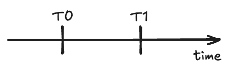
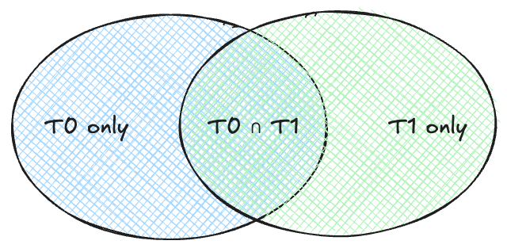
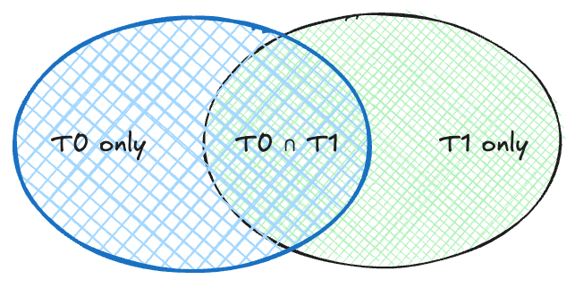
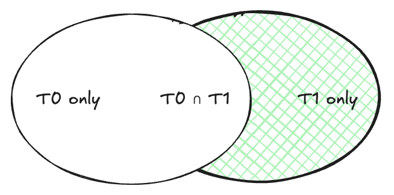

# Efficient Event Extraction with Polars

## Overview

The event extraction process is the core innovation enabling **2,142× compression** while maintaining complete data fidelity. Instead of storing full market snapshots every 5 minutes, we extract only the **changes** (events) between snapshots, reducing storage from 2,455 MB/day to just 16 MB/day.

**Key Insight:** Only **0.27%** of market orders change per 5-minute interval.

## Temporal Model: Snapshots as Time Points

Market data is captured in **snapshots** at regular intervals (every 5 minutes). We compare consecutive snapshots to detect changes:

- **T0** (Previous snapshot): The baseline state at time T
- **T1** (Current snapshot): The new state at time T + 5 minutes



**Example:**

```
T0 (07:00:00): 375,320 orders
T1 (07:05:00): 382,150 orders
               ↓
         Detect changes between T0 → T1
               ↓
         Extract 1,023 delta events
```

--------------------------------------------------------------------------------

## Architecture: Two-Phase Approach

### Phase 1: Initialization

Create baseline from the first snapshot (T0) by generating one `ORDER_OPENED` event per existing order. This makes the event log **self-contained** - you can reconstruct the complete order book from events alone without requiring the original snapshot.

### Phase 2: Delta Extraction

Compare consecutive snapshots (T0 → T1) to detect six types of market events:

Event Type        | Trigger
----------------- | --------------------------------------------
`TRADE`           | Volume reduced
`ORDER_OPENED`    | New order appeared
`ORDER_CLOSED`    | Order disappeared with volume=0
`ORDER_CANCELLED` | Order disappeared with volume>0, not expired
`PRICE_CHANGED`   | Price modified
`ORDER_EXPIRED`   | Natural expiration time reached

--------------------------------------------------------------------------------

## Implementation using Polars

The event detection algorithm uses standard DataFrame operations (joins, filters) that work identically in Pandas or Polars. We chose **Polars for performance**:

- **Multi-threaded execution:** Joins and filters run on all CPU cores automatically
- **Lower memory overhead:** Apache Arrow columnar format vs. Python object overhead
- **Pure Rust implementation:** Generally faster

### Extracting events

We use joins and filters to separate the events.



### 1\. Left Join to find all get all orders with changes

Instead of iterating through orders individually (slow), we use a left join:

```python
# Join T0 (previous) and T1 (current) snapshots
joined = prev_snapshot.join(  # T0
    current_snapshot,          # T1
    on='order_id',
    how='left',  # Keep all T0 orders
    suffix='_curr'
)
```



This produces a combined DataFrame where:

- Matched rows contain data from both snapshots
- Unmatched rows (NULL in `_curr` columns) indicate disappeared orders

### 2\. Event Detection

Extract multiple event types using filtering:

```python
# Disappeared orders (no match in current)
disappeared = joined.filter(pl.col('type_id_curr').is_null())

# Still present orders
still_present = joined.filter(pl.col('type_id_curr').is_not_null())

# Partial fills (volume reduced)
partial_fills = still_present.filter(
    pl.col('volume_remain') > pl.col('volume_remain_curr')
)

# Price changes
price_changes = still_present.filter(
    pl.col('price') != pl.col('price_curr')
)
```

### 3\. Anti-Join for New Orders

Detect new orders efficiently using an **anti-join** (orders in T1 but not in T0):

```python
new_orders = current_snapshot.join(  # T1
    prev_snapshot.select(['order_id']),  # T0
    on='order_id',
    how='anti'  # Only orders NOT in T0
)
```



### 4\. Event Classification Logic

#### Disappeared Orders

Use conditional logic to classify why orders disappeared:

```python
df = disappeared.with_columns([
    # If volume=0 → fully filled, else cancelled/expired
    pl.when(pl.col('volume_remain') == 0)
      .then(pl.lit('order_closed'))
      .otherwise(pl.lit('order_cancelled'))
      .alias('event_type'),
])
```

For expiration detection, we check if the order's scheduled expiration time falls within the 5-minute interval:

```python
expiration_time = issued_datetime + timedelta(days=duration)
time_to_expiration = (expiration_time - timestamp).total_seconds()

if -300 <= time_to_expiration <= 0:  # Within 5-min window
    event_type = 'order_expired'
    confidence = 0.95
```

#### Partial Fills (Trades)

Calculate traded volume vectorized:

```python
df = partial_fills.with_columns([
    pl.lit('trade').alias('event_type'),
    (pl.col('volume_remain') - pl.col('volume_remain_curr')).alias('volume'),
    pl.lit(1.0).alias('confidence')
])
```

#### Price Changes

Capture new price and remaining volume:

```python
df = price_changes.with_columns([
    pl.lit('price_changed').alias('event_type'),
    pl.col('volume_remain_curr').alias('volume'),
    pl.col('price_curr').alias('price'),
    pl.lit(1.0).alias('confidence')
])
```

--------------------------------------------------------------------------------

## Sparse Schema Design

Events use a **sparse schema** where different event types populate different field subsets:

### Core Fields (Always Present)

```
- event_type
- timestamp
- type_id
- order_id
```

### Delta Fields (~85% of events)

Used by `TRADE`, `PRICE_CHANGED`, `ORDER_CANCELLED`, `ORDER_EXPIRED`:

```
- volume
- price
- is_buy_order
- system_id
- confidence
```

### Full-State Fields (~15% of events)

Only used by `ORDER_OPENED` to enable order book reconstruction:

```
- location_id      (85% NULL)
- volume_total     (85% NULL)
- min_volume       (85% NULL)
- duration         (85% NULL)
- issued           (85% NULL)
- range            (85% NULL)
```

**Why This Works:** Parquet's columnar format with **Run-Length Encoding (RLE)** makes NULL storage virtually free. A column with 85% NULLs compresses to a tiny bitmap.

Example:

```
Column "location_id": [123, NULL, NULL, NULL, NULL, 456, NULL, ...]
Parquet RLE: [123 (1×), NULL (4×), 456 (1×), NULL (1×), ...]
```

--------------------------------------------------------------------------------
